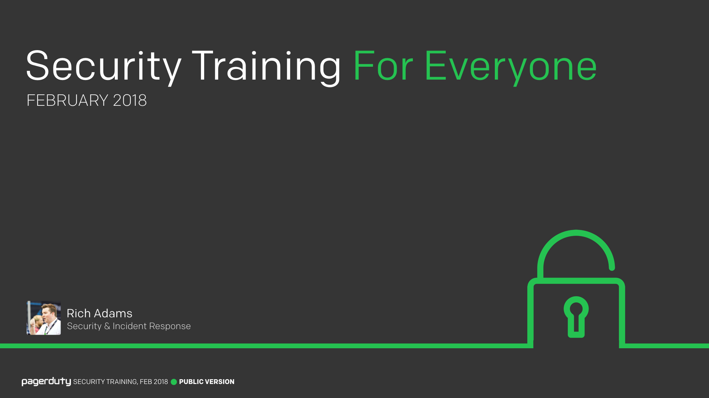
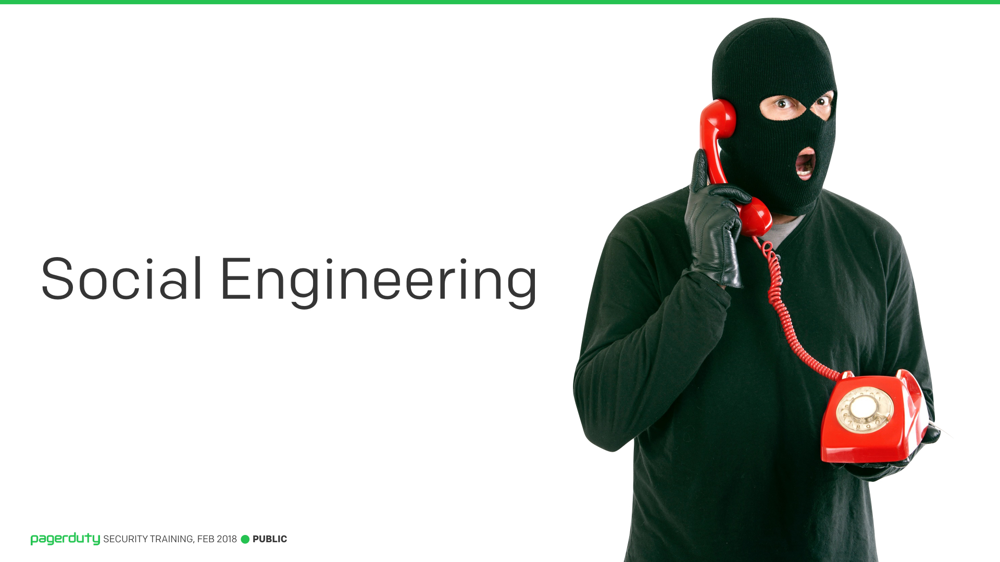
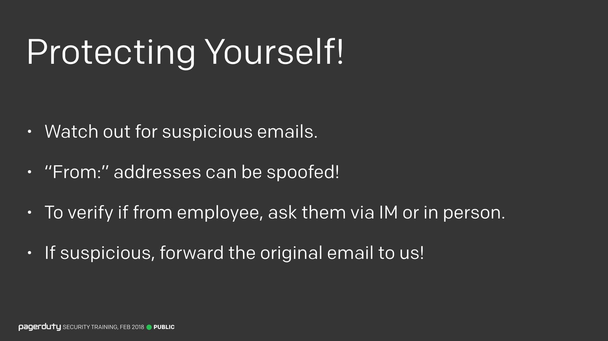
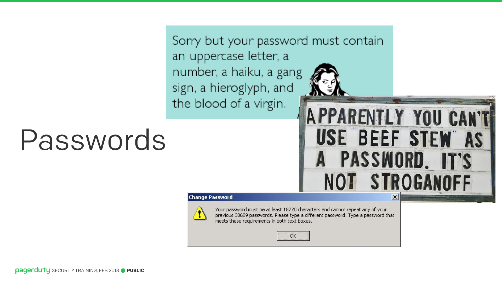
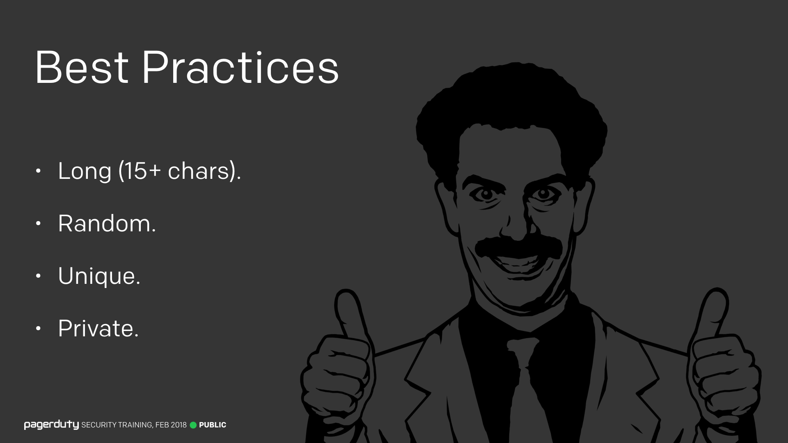
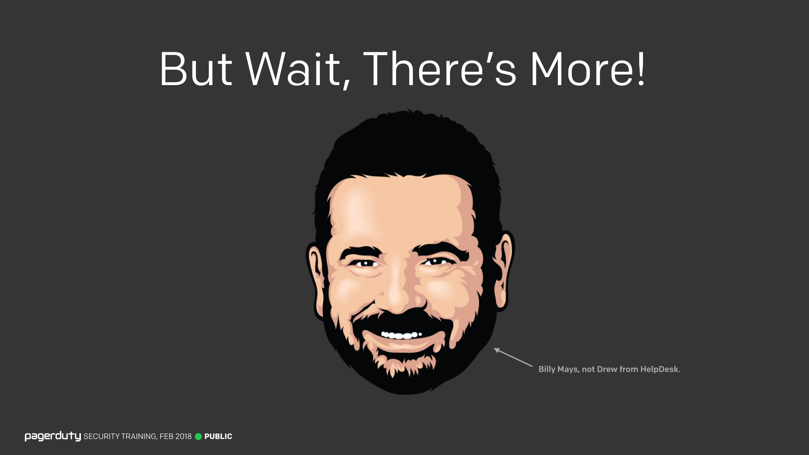
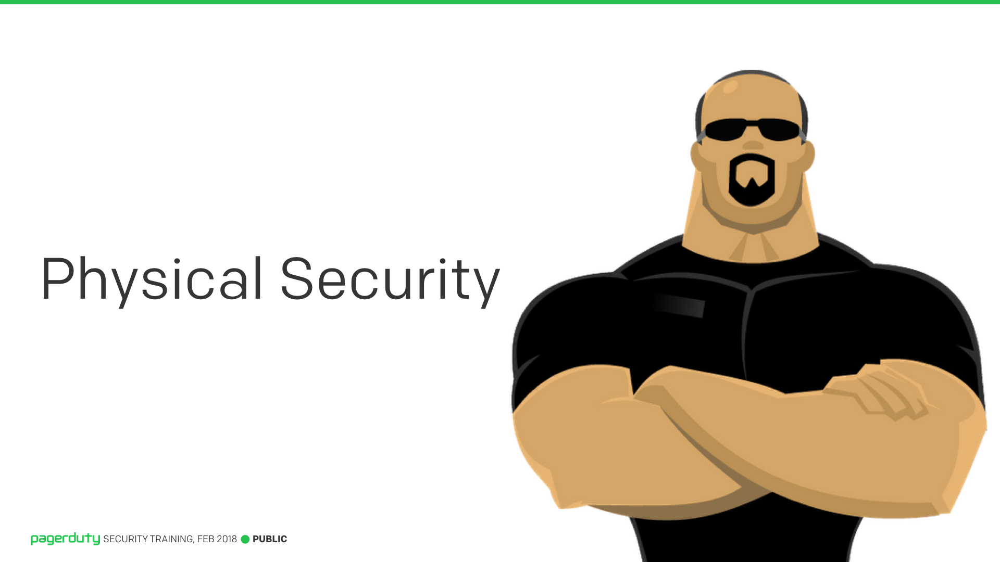
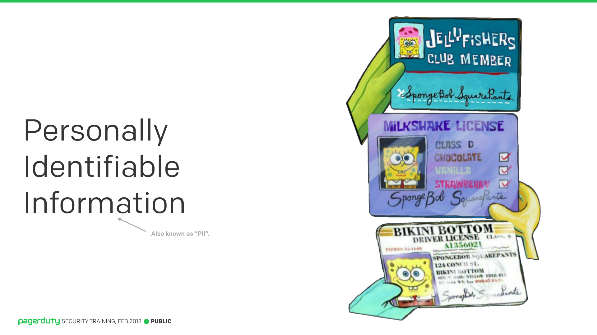
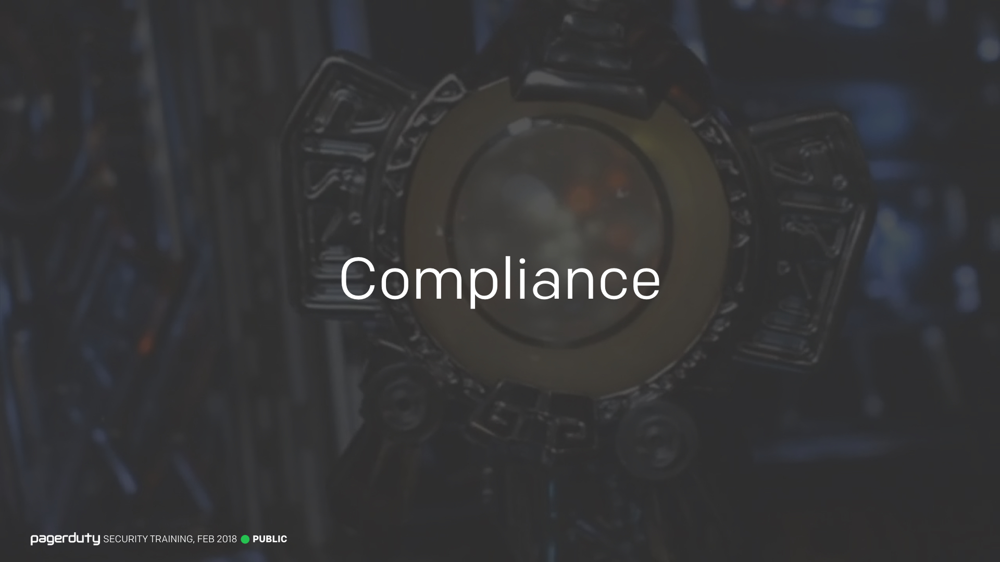
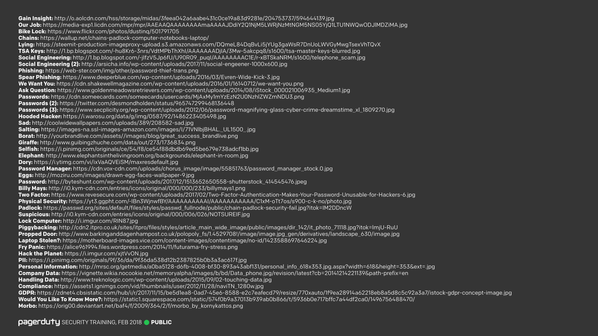

### Lessons

<input type="checkbox" id="001" /><label for="001"></label>
_001. "Security Training for Everyone, February 2018"_

[Lesson 1. Introduction](lessons/Lesson_01_Introduction/)

---

<input type="checkbox" id="002" /><label for="002"></label>
_002. "Lesson 2. Social Engineering"_

[Lesson 2. Social Engineering](lessons/Lesson_02_Social_Engineering/)

---

<input type="checkbox" id="003" /><label for="003"></label>
_003. "Lesson 3. Social Engineering - Phishing"_

[Lesson 3. Social Engineering - Phishing](lessons/Lesson_03_Social_Engineering_Phishing/)

---

<input type="checkbox" id="004" /><label for="004"></label>
_004. "Lesson 4. Social Engineering - Protect Yourself"_

[Lesson 4. Social Engineering - Protect Yourself](lessons/Lesson_04_Social_Engineering_Protect_Yourself/)

---

<input type="checkbox" id="005" /><label for="005"></label>
_005. "Lesson 5. Passwords"_

[Lesson 5. Passwords](lessons/Lesson_05_Passwords/)

---

<input type="checkbox" id="006" /><label for="006"></label>
_006. "Lesson 6. Password Best Practices"_

[Lesson 6. Password Best Practices](lessons/Lesson_06_Password_Best_Practices/)

---

<input type="checkbox" id="007" /><label for="007"></label>
_007. "Lesson 7. More than Passwords"_

[Lesson 7. More than Passwords](lessons/Lesson_07_More_than_Passwords/)

---

<input type="checkbox" id="008" /><label for="008"></label>
_008. "Lesson 8. Physical Security"_

[Lesson 8. Physical Security](lessons/Lesson_08_Physical_Security/)

---

<input type="checkbox" id="009" /><label for="009"></label>
_009. "Lesson 9. Data Handling"_

[Lesson 9. Data Handling](lessons/Lesson_09_Data_Handling/)

---

<input type="checkbox" id="010" /><label for="010"></label>
_010. "Lesson 10. Compliance"_

[Lesson 10. Compliance](lessons/Lesson_10_Compliance/)

---

### Image Credits

<input type="checkbox" id="142" /><label for="142"></label>
_142. Image credits._

???+ info "Information"
    Here are the credits for all the images used throughout this training.

---

!!!question "Spotted a Problem?"
    Security is hard, and we're not perfect. There may be mistakes or misunderstandings in this training material. If you find a problem, please help us correct it! This project is [open-source on GitHub](https://github.com/pagerduty/security-training) and we appreciate all friendly contributions.

*[SRE]: Site Reliability Engineering
*[NDA]: Non-Disclosure Agreement
*[ISP]: Internet Service Provider
