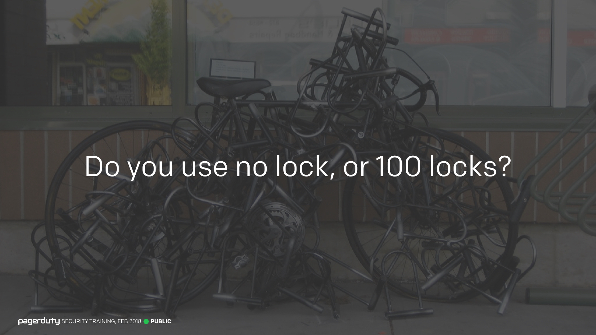
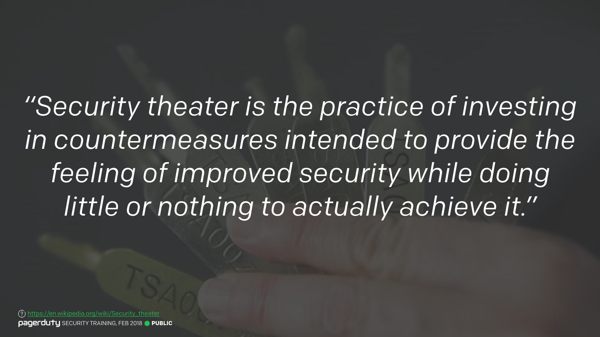

Title:
Lesson 1 | Introduction to PagerDuty Security Awareness Training

---

Lesson Notes:
:dart: Intended Audience: All employees, regardless of function.
:dart: Intended Frequency: The goal of today's training is to make sure that we can maintain and build customer trust by having a staff who are well trained against the most common security threats that we face.

---

Lesson Content:

Welcome to "Security Training for Everyone". This is an annual employee security training session, and is a requirement to both satisfy obligations to customers, but also to pass compliance audits. This stuff is really important, so I'd like to ask you all to pay as close attention as you can. The training is divided into 5 sections:
1. Social engineering
2. Phishing
3. Passwords
4. Physical Security
5. Data Handling
6. Compliance

The goal of today's training is to make sure that we can maintain and build customer trust by having a staff who are well trained against the most common security threats that we face. It's not just about knowing what threats we're up against, it's about knowing how to protect us from those threats too.

There's a trade-off between security and convenience, with two extreme ends of a spectrum. Too far one way, and we're not secure, too far the other, and we're secure but completely unusable. 

Importantly, we never want to fake security. Faking security leads us down a dark path, and will give us a false sense of security. 

---

External resources:

### Introduction

<input type="checkbox" id="001" /><label for="001"></label>
_001. "Security Training for Everyone, February 2018"_

Welcome to "Security Training for Everyone". This is an annual employee security training session, and is a requirement to both satisfy obligations to customers, but also to pass compliance audits. This stuff is really important, so I'd like to ask you all to pay as close attention as you can.

---

### Goal

<input type="checkbox" id="002" /><label for="002"></label>
_002. Goal of the training._

Why have I brought you all here today? What's the point of all this?

The goal of today's training is to make sure that we can maintain and build customer trust by having a staff who are well trained against the most common security threats that we face. It's not just about knowing what threats we're up against, it's about knowing how to protect us from those threats too.

Despite our best efforts, security can't have eyes everywhere. We rely on all of you to help us spot security issues and let us know about them.

---

### Our Job

<input type="checkbox" id="007" /><label for="007"></label>
_007. Our job as a security team._

Why does a security team even exist? Despite what you may think, we're not here to say "No" to everything, or to chastise you for doing something "wrong". We're here to keep PagerDuty secure, and to make it easy for you to do the right (i.e. secure) thing automatically. Never be afraid to come to us for help, or to let us know you may have done something that put us at risk. We'd rather know about it than not! If we've implemented a security feature that has made your life unnecessarily more annoying, we want to know about that too, since our goal isn't to add features that make your life harder.

We're not here to be a bottleneck either, you'll notice that user access reviews don't go through the security team, and we don't have to sign-off on everything security related. Teams are trusted to make their own decisions (within reason).

---

### Question

<input type="checkbox" id="009" /><label for="009"></label>
_009. Bike locks._

Now a quick question to get things rolling. Let's say you're the healthy type, and you like to cycle around the city. _(As you can probably tell from my physique, I am not one of these types)_. You are somewhere around the streets of San Francisco, and need to secure your bike. You have two choices, you can just leave it on the street without any lock at all, or you can take the morning off work and use 100 locks instead. Which do you chose?

Hopefully you've realised that both of these answers are absurd and not going to work. Using no lock leaves you with no security at all and your bike won't be there when you return, whereas using 100 locks will leave your bike very secure, but you'll need to take the day off in order to lock and unlock it.

---

### Security vs Convenience

<input type="checkbox" id="010" /><label for="010"></label>
_010. Security vs convenience._

The point I'm trying to make is that there's a trade-off between security and convenience, with two extreme ends of a spectrum. Too far one way, and we're not secure, too far the other, and we're secure but completely unusable. If you get a bunch of people in a room and ask them if they want to be secure, they'll say yes. But given the choice between being secure and having convenience, most folks opt for convenience.

---

### Be Secure, But Usable

<input type="checkbox" id="011" /><label for="011"></label>
_011. Be secure, but usable._

Our job is to strike a good balance between the options. We want to make sure that our products and services, and as an office environment, is both secure and usable. Our goal is not to add friction to your day-to-day jobs, but we can't sit entirely at the convenience end of the scale either. So while we may force you into following certain procedures, please know that it's not because we like annoying you, but it's because we don't really have a choice.

---

### No Faking

<input type="checkbox" id="012" /><label for="012"></label>
_012. No faking._

Importantly, we never want to fake security. Putting a sign saying you have a burglar alarm on your front lawn when really you don't might deter a few criminals, but anyone who really wants to steal something will just ignore it anyway.

---

### Faking is the Path to the Dark Side

<input type="checkbox" id="013" /><label for="013"></label>
_013. Yoda, dropping some knowledge on fake security._

Faking security leads us down a dark path, and will give us a false sense of security. There are multiple ways to fake security. Some terms you may have heard of are "Security Through Obscurity", where the secrecy of the implementation is being relied upon. Imagine a padlock manufacturer coming out with a padlock they say is unbreakable. You want to look inside to see how it works, but they say "No no no, you can't do that, that would give away the secret. You're not allowed to look inside!". Criminals, of course, being well known for following the rules.

Another term you may have heard of is "Security Theatre"...

---

### Security Theater

<input type="checkbox" id="014" /><label for="014"></label>
_014. What is security theater? [Reference](https://en.wikipedia.org/wiki/Security_theater)_

This is where you spend time and effort on things which merely give the _appearance_ of improved security, without actually providing it. A lot of people hold up the TSA as an example of this, but I want to use the TSA as another example of where bad security came to bite them.

A "backdoor" is another type of fake security. This refers to when there's a supposedly secret method of bypassing the security of something, typically only given to a few people.

---

### TSA Baggage Locks

<input type="checkbox" id="015" /><label for="015"></label>
_015. Story in the Washington Post. [Reference](https://www.washingtonpost.com/local/trafficandcommuting/where-oh-where-did-my-luggage-go/)_

You may remember a news story a few years ago in the Washington Post. It was around Thanksgiving, and they had an article all about how the TSA keep your bags safe during the holiday period. They held up TSA locks as an example. You've probably seen these locks, where you have a code or key to unlock it, but the TSA also has master keys to unlock it. The article included a photo of these master keys. Quite a high resolution photo in fact. So I'm sure you can guess what happened next.

---

### 3D Print TSA Master Keys

<input type="checkbox" id="016" /><label for="016"></label>
_016. Print your own TSA master key from the comfort of your own home. [Reference](https://github.com/Xyl2k/TSA-Travel-Sentry-master-keys/)_

Yep, you can now 3D print your own TSA master keys in the comfort of your own home.

Any security provided by these locks are now ineffective. You might still deter a few folks, but anyone who's determined to get in your bags will now have a much easier time of doing it.

Backdoors pop up all over the place. Do any of you have a modem provided by your ISP? Pretty much every one of them has a backdoor on them for the purposes of customer support. A secret password that the customer support agents know, usually derived from your modem serial number in some way, that gives them the ability to change settings if you call them up. A lot of times attackers can figure out the patterns used and also get access to your modem. Google ["ARRIS modem backdoor"](https://encrypted.google.com/search?q=ARRIS+modem+backdoor) if you want to read about one example.

Hopefully you're starting to see why faking security is a bad thing, and something we want to stay away from.
