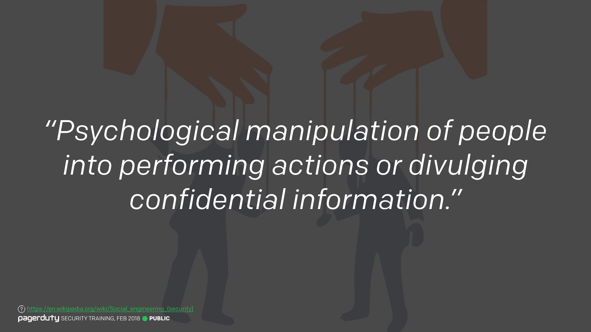
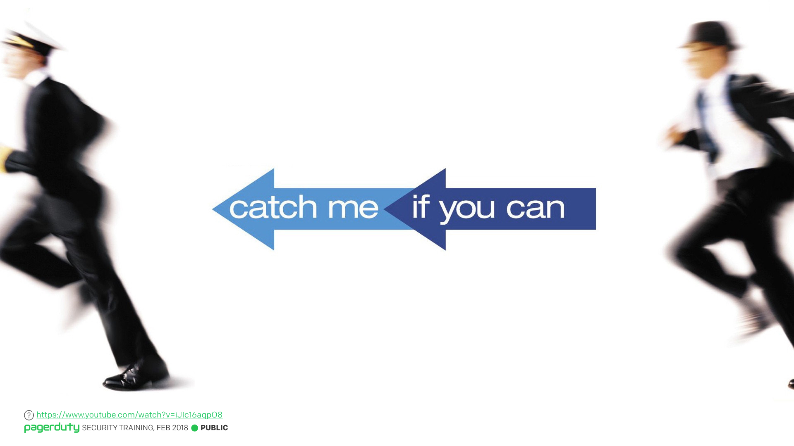
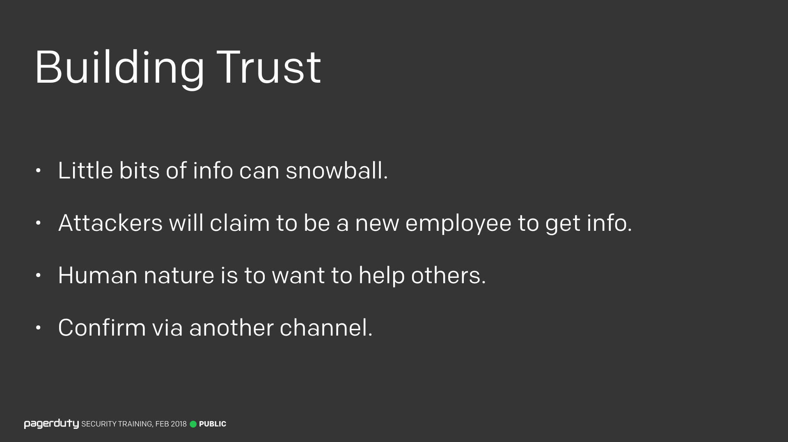
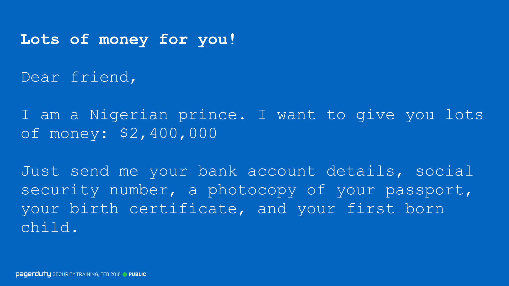
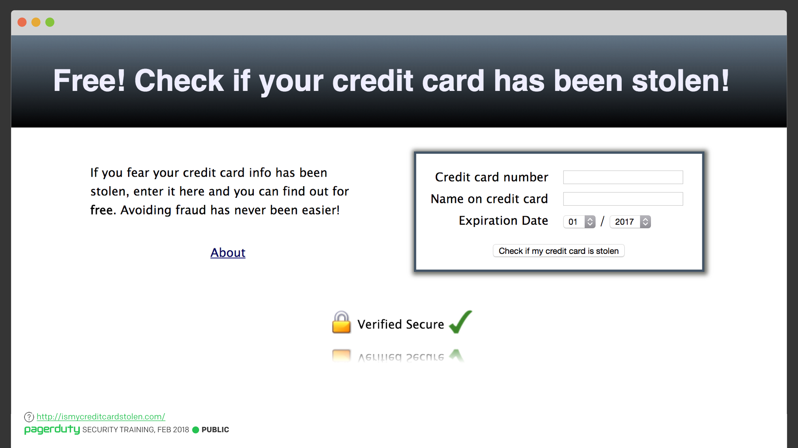
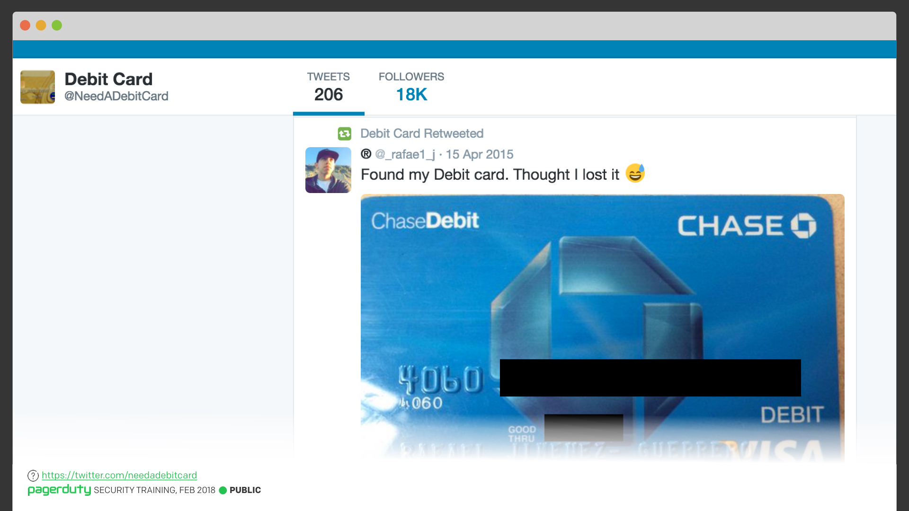

Title:
Lesson 2 | Social Engineering

---

Lesson Notes:
:dart: Social engineering is convincing people to give up information either without them realizing it, or by making them believe you're someone else.
:dart: Social engineering is mostly about building trust.

---

Lesson Content:

Here's a quick definition of what social engineering is. Basically it's a type of confidence trickery. Social engineering is mostly about building trust. This is hard to defend against, since human nature is to want to help others.

So if someone contacts you claiming to be an employee, and you've never heard of them before, verify they are who they say they are via another channel. If they email you, ping them on Slack to check (and vice versa).

The term *Phishing* is from "fishing for information", and generally involves receiving an email designed to trick you into giving up information.

Social engineering isn't just about phishing, even though that's the focus in this training. There are many more types of social engineering attacks we can face.

---

External resources:

### What is Social Engineering?

<input type="checkbox" id="018" /><label for="018"></label>
_018. What is social engineering? [Reference](https://en.wikipedia.org/wiki/Social_engineering_(security))_

For those who've not heard the term before, here's a quick definition of what social engineering is. Basically it's a type of confidence trickery. Convincing people to give up information either without them realizing it, or by making them believe you're someone else.

---

### Catch Me If You Can

<input type="checkbox" id="019" /><label for="019"></label>
_019. Catch Me If You Can. [Reference](https://www.youtube.com/watch?v=iJIc16aqpO8)_

If you've ever seen the movie "[Catch Me If You Can](https://www.imdb.com/title/tt0264464/)" (or read the book) you will have seen lots of examples of social engineering. "[Ferris Bueller's Day Off](https://www.imdb.com/title/tt0091042/)" is another one. If you've not seen either of those movies, I'd highly recommend giving them a watch. The link at the bottom of the slide here is to a [talk by Frank Abagnale Jr](https://www.youtube.com/watch?v=iJIc16aqpO8), the real person on which *Catch Me if You Can* is based. He tells the story of his exploits. It's quite entertaining and eye opening.

---

### Building Trust

<input type="checkbox" id="020" /><label for="020"></label>
_020. Building Trust._

Social engineering is mostly about building trust. If I wanted to social engineer the CEO of PagerDuty, Jenn would not be my first phone call. I'd start by calling a low-level employee claiming to be a new employee needing help, or I'd call a new employee and claim to be an established employee asking for help. I'd learn some little bits of information, maybe a bit of internal lingo that's being used. Then the next person I call would be slightly higher up the chain, I'd use the information I learned on the first call to sound more credible. And so on and so on.

By the time I call the CEO, I'd have so much internal knowledge and language for the company that it would sound like I was an employee anyway.

This is hard to defend against, since human nature is to want to help others. So if someone contacts you claiming to be an employee, and you've never heard of them before, verify they are who they say they are via another channel. If they email you, ping them on Slack to check (and vice versa).

---

### ~~Fishing~~ Phishing

_<input type="checkbox" id="022" /><label for="022"></label>_
_022. ~~Fishing~~ Phishing._

I'm going to focus on one particular type of social engineering attack that we get exposed to, phishing (with a P-H), and again, this is another one of my favourite stock images. The term comes from "fishing for information", and generally involves receiving an email designed to trick you into giving up information. As we get larger as a company, we become more of a target for these types of attacks.

---

### Nigerian Prince Scam

<input type="checkbox" id="023" /><label for="023"></label>
_023. Nigerian Prince Scam._

Some phishing attacks can be pretty easy to spot. You've all likely heard of the Nigerian Prince Scam. This is where an email claiming to be someone who can give you lots of money is sent to lots of people. This is a very "spray and pray" approach to scamming. Maybe 1 or 2 people will bite, but that makes it worthwhile enough for the scammer. These are pretty easy to spot, and not something we really worry about. Hopefully none of you would ever fall for something like this.

---

### Is My Credit Card Stolen?

<input type="checkbox" id="024" /><label for="024"></label>
_024. ismycreditcardstolen.com. [Reference](http://ismycreditcardstolen.com/)_

But you don't even have to send emails to people, sometimes you can just lay a trap and people will gladly provide you with information instead. Here's a great website, [ismycreditcardstolen.com](http://ismycreditcardstolen.com). You just enter your credit card information, and it'll helpfully tell you if it's been stolen or not. Of course, as soon as you enter the details, your credit card information has in fact been stolen.

But it has that nice "Verified Secure", with the padlock and green tick, so it must be OK, right?

---

### Need a Debit Card?

<input type="checkbox" id="025" /><label for="025"></label>
_025. twitter.com/needadebitcard. [Reference](https://twitter.com/needadebitcard)_

Taking it a step further, sometimes you don't even need to lay a trap, you can just search the internet for the information you want. There's a great Twitter account called [@NeedADebitCard](https://twitter.com/needadebitcard), which retweets people who post pictures of their debit cards to Twitter.

It gets better, because often the replies will be _"Looks great, what does the back look like?"_, and then they'll go and post a picture of the back too!

I really hope that none of you would fall for anything like this.

These are all interesting to see, but the type of attack we care most about are the more targeted ones.
---

Lesson Scenario:
What is social engineering?

- <input type="checkbox"> `Phishing is the only type of social engineering`
- <input type="checkbox"> `It is about building trust `
- <input type="checkbox"> `It's not something you need to worry about`
- <input type="checkbox"> `Social engineering is an uncommon form of attack`

	<button class="button">Reveal Answer</button>
	<blockquote>
Social engineering includes many different types of attacks and is highly common. It is about building trust.

</blockquote> 
