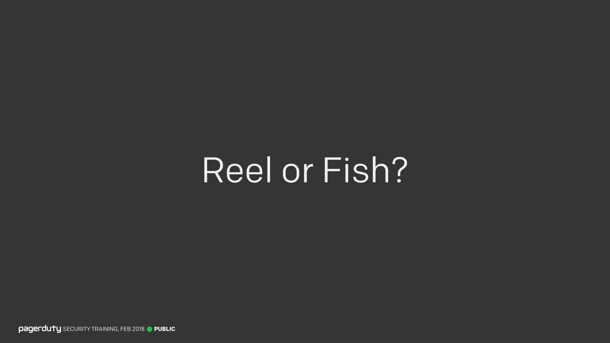
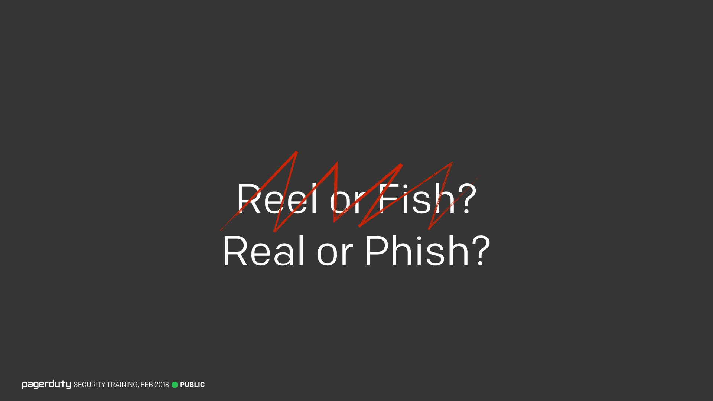
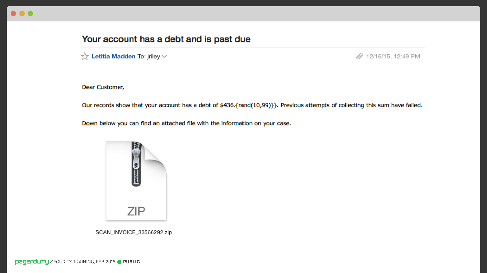
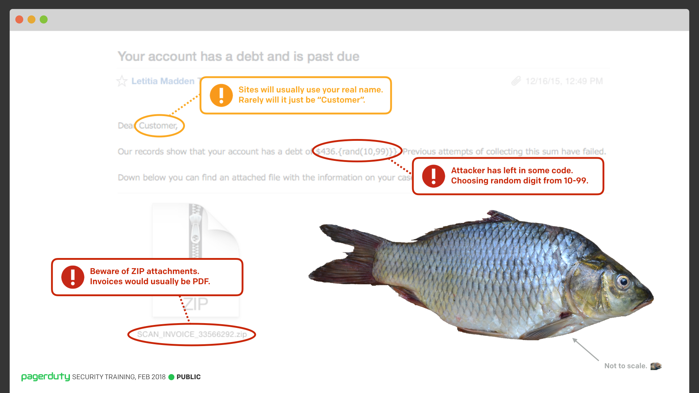
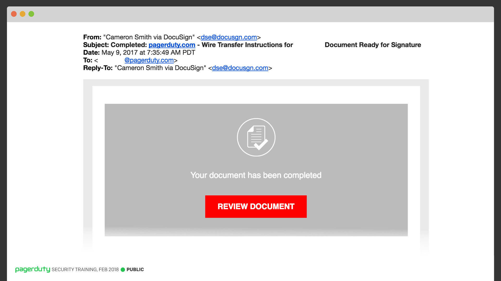
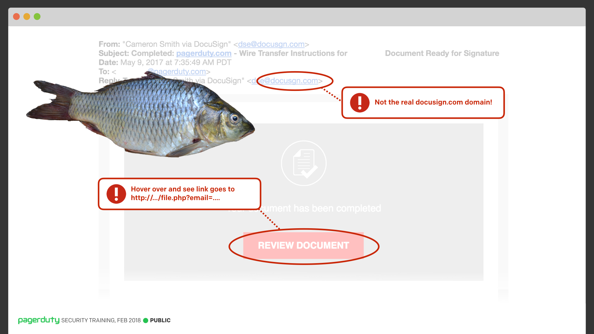
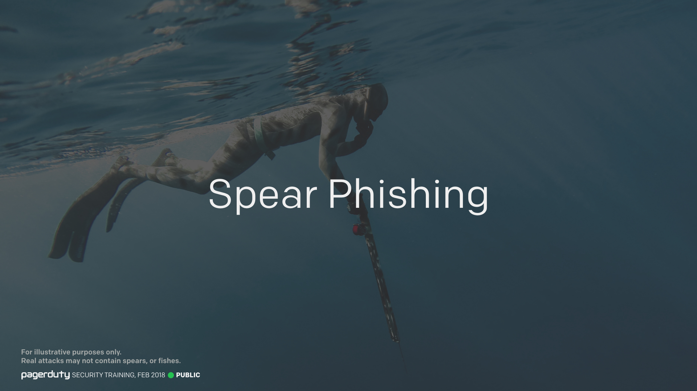

Title:
Lesson 3 | Social Engineering Phishing

---

Lesson Notes:
:dart: Phishing attacks are the most common form of social engineering.
:dart: There are signs that should make you suspicious of phishing attacks, learn the ones in this training.

---

Lesson Content:

Phishing attacks have become very sophisticated and targeted but there are signs to spot these fake emails. If you get a communication from someone which sounds suspicious, confirm with them via another channel (Slack, etc).

Some red flags to look for:
* A yellow flag in that it said "Dear Customer", most emails now will be personalized with your name if they know it.
* A red flag in that there's a `.zip` attachment for an invoice, as these would typically be a PDF.
* Misspelled domains like DocuSgn instead of DocuSign

More targeted phishing attacks are called "[Spear Phishing](https://en.wikipedia.org/wiki/Phishing#Spear_phishing)". An attacker spends a lot of time learning about crafting a legitimate looking email in order to try and get lots of money from us. These are the types of attacks we care the most about protecting against.

---

External resources:

### Reel or Fish?

<input type="checkbox" id="026" /><label for="026"></label>
_026. Reel or Fish?._

So I'd like to play a quick game with you all now. I know, audience participation, right? But don't worry, it's a fun game, honest.

It's a game I've called "Reel or Fish?"

---

### Real or Phish?

<input type="checkbox" id="027" /><label for="027"></label>
_027. Real or Phish?._

Sorry, I mean "Real or Phish?"

I'm going to show you some genuine emails that have been sent to PagerDuty employees (shared with the recipients permission of course), and it's your job to tell me if you think it's a real email, or a phishing attempt.

---

### Your account has a debt and is past due.

<input type="checkbox" id="028" /><label for="028"></label>
_028. Your account has a debt and is past due._

Let's start with this one, which was sent to a member of our SRE team.

_"Our records show that your account has a debt of $436.{rand(10,100)}}. Previous attempts of collecting this sum have failed."_

What do we think?
---

### Phish!

<input type="checkbox" id="029" /><label for="029"></label>
_029. Phish!._

Yes, of course this is a phishing attempt. Quite an easy one to spot thanks to the fact the attacker left in their templating code rather than putting in the cents value. But there were some other indicators here too,

* A yellow flag in that it said "Dear Customer", most emails now will be personalized with your name if they know it.
* A red flag in that there's a `.zip` attachment for an invoice, as these would typically be a PDF.

But of course, the primary red flag is the templating code.

---

### DocuSign?

<input type="checkbox" id="030" /><label for="030"></label>
_030. DocuSign?_

Ok, let's try another one. What do we think about this email from DocuSign?

Looks like a genuine DocuSign email, has the usual style, same big "Review Document" button. Anything suspicious here?

---

### DocuSgn

<input type="checkbox" id="031" /><label for="031"></label>
_031. DocuSgn._

This is another phishing email. If you look closely at the domain name in the email, you'll see that it's not the real `docusign.com` domain, but rather `docusgn.com` (Note the missing `i`). An attacker specifically registered a domain similar to the real one, and sent emails that for all intents and purposes look like the real thing, in order to try and steal your DocuSign credentials. Attacks like these are becoming more and more common.

One thing you wouldn't have been able to tell from my screenshot, but would if you were viewing this in your email client, is that the "Review Document" link doesn't actually go to a DocuSign domain either. It went to some completely different domain (it wasn't even close to docusign.com) and had some parameters at the end which included your email address.

One takeaway here is to be sure to hover over any links to see the real address they go to _before_ you click on them. Just because the text in the email says one thing, it doesn't mean that's where the actual link may go. Never click on any links in email that are even remotely suspicious. Sometimes all it takes is a click to do bad things.

???+ comment "Presenter's Comment"
	Top tip: If it's a shortened URL with bit.ly, you can append a `+` to the URL to see where it goes without actually following it.

If you do accidentally click a link in a phishing email, please let us know immediately, as it can affect how we respond to the incident. Don't lie to us to save face, we're not going to ridicule you or shout at you for clicking it, we want to know so that we can properly respond to any potential exploit that could have happened.

---

### Spear Phishing

<input type="checkbox" id="037" /><label for="037"></label>
_037. Spear phishing._

These much more targeted attacks are called "[Spear Phishing](https://en.wikipedia.org/wiki/Phishing#Spear_phishing)". An attacker spent a lot of time learning about our internal org structure and crafting a legitimate looking email in order to try and get lots of money from us. These are the types of attacks we care the most about protecting against.

If you're interested in more of the types of attacks we get, please take a look at our Phishing Archive.

---

Lesson Scenario:
What are some of the warning signs for phishing emails?

- <input type="checkbox"> `Attachments, especially .zip files.`
- <input type="checkbox"> `Mispelled domains. `
- <input type="checkbox"> `Strange greetings, like "Dear Customer", that are not personalized. `
- <input type="checkbox"> `Domain names that are not the official domain of the sender company.`
- <input type="checkbox"> `All of the above.`

	<button class="button">Reveal Answer</button>
	<blockquote>
There are red flags that should alert you to a potential phishing email. All of the above answers are red flags.

</blockquote> 
