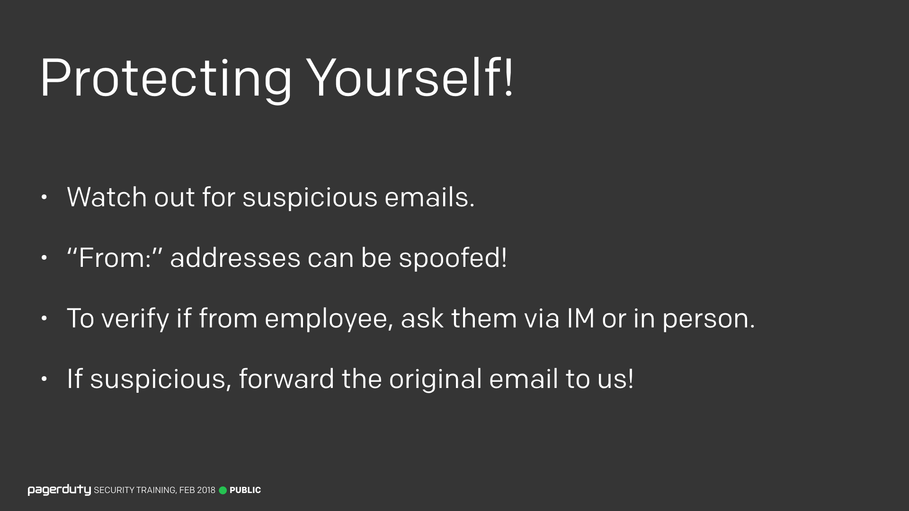

Title:
Lesson 4 | Social Engineering Protect Yourself

---

Lesson Notes:
:dart: Remain vigilant. Social engineering attacks are constant and dynamic.
:dart: If in doubt, do no open the email or attachment or link.

---

Lesson Content:

If you get a communication from someone which sounds suspicious, confirm with them via another channel (Slack, etc). Especially if money is involved!

Finally, remember to **never click on any links in a mail you think may be phishing**.

Social engineering isn't just about phishing, even though that's what I focused on here. There are many more types of social engineering attacks we can face.

As with anything security related, if you're not sure if you've encountered a social engineering attack, or if you're curious to know more, just ask.

---

External resources:

### Protecting Yourself

<input type="checkbox" id="039" /><label for="039"></label>
_039. Protecting yourself._

So how do we protect ourselves from this type of attack? Unfortunately there's no golden rule I can give you. It's up to us all to remain vigilant and watch for the signs of suspicious emails. Some things to take care with, the "from" address of email can easily be spoofed. There are technologies that can help to prevent this, but they're not implemented everywhere. So while a misspelled domain is a strong indicator of phishing, a real domain isn't a 100% indicator that it's genuine.

It's like postal mail, you can put whatever you want as the return address, doesn't mean it really came from there. (In fact, this used to be an old scam, you could swap the return and mail-to address, mail it without postage, and the post office would return to the "sender". I would strongly advise against trying this though, since mail fraud is a federal offense here in the US).

Don't forget that if you get a communication from someone which sounds suspicious, confirm with them via another channel (Slack, etc). Especially if money is involved!

And if you suspect you've received a phishing attempt, send it on over to the security team so we can improve our filters (and add it to the Phishing Archive).

Finally, remember to **never click on any links in a mail you think may be phishing**.

---

### You Are Our Greatest Asset!

<input type="checkbox" id="044" /><label for="044"></label>
_044. You are our greatest asset!_

Automatic filtering only gets us so far. It's up to all of you to be able to spot suspicious emails and send them to us. The good news is that you're already great at this! We managed to preemptively block several phishing attacks last year thanks to quick employee reports. Most were deleted from your inbox before you even read them. Don't assume someone else has already sent us the example, do it anyway. We'd rather have 300 duplicate reports than no report at all.

---

### Not Just Phishing

<input type="checkbox" id="045" /><label for="045"></label>
_045. Not just phishing. [Reference](https://en.wikipedia.org/wiki/Social_engineering_(security)#Techniques_and_terms)_

Social engineering isn't just about phishing, even though that's what I focused on here. There are many more types of social engineering attacks we can face.

For example, the meeting invite for this training said that there would be free cake and desserts served. Sorry to disappoint, but that was a lie, and is an example of "Baiting".

Another type of social engineering is called "Pretexting", pretending to be someone else to get information. For example, let's say you're on sales and you receive a phone call: "Hi, this is Tim from [large customer], we're having trouble with our account. I need to speak to our account manager right now, this is urgent, we're losing $100,000's every minute here!", you'd probably say "Sure, let me put you in touch with [account manager for large customer]", and now you just gave away that [large customer] is a customer, to someone who hadn't verified who they are. Very easy to get tricked this way, but very hard to defend against without being confrontational.

One thing to beware of is a forced sense of urgency. In the above example, the attacker threw about the fact they were losing $100,000's every minute, in order to try and add urgency to the situation and force you to make rash decisions. I don't have a perfect way to solve this, just be vigilant, and report anything suspicious.

Another trick social engineers like to pull is to force you into a particular communications channel. For example, if you receive an email claiming to be from an employee, but they say they're uncontactable by phone today and would rather you communicate via email. This is why it's important to verify via another channel if you're unsure.

One final example of social engineering would be leaving a USB drive lying on the floor with a virus on it. People love to pick up free USB drives for some reason. Scatter them outside of the office and see if anyone plugs them in, getting you access to a corporate network. If you find a USB drive on the floor and it's not yours, please don't let it anywhere near your computer.

---

### Ask us!

<input type="checkbox" id="046" /><label for="046"></label>
_046. Ask us._

As with anything security related, if you're not sure if you've encountered a social engineering attack, or if you're curious to know more, just ask us! We don't bite! (Well, not all of us).

---

Lesson Scenario:
What should you do if you receive an email you think might be a phishing email?

- <input type="checkbox"> `Reply to the email to verify the sender.`
- <input type="checkbox"> `Click the link in the email to check if it's a real website. `
- <input type="checkbox"> `Call, Slack, or reach out to the sender but not via email. `
- <input type="checkbox"> `Forward the email to your group to see if they got the same one.`

	<button class="button">Reveal Answer</button>
	<blockquote>
If you get a communication from someone which sounds suspicious, confirm with them via another channel (Slack, etc).

</blockquote> 
