Title:
Lesson 6 | Passwords Best Practices

---

Lesson Notes:
:dart: You should make passwords 1) long, 2) random, 3) unique, and 4) private.
:dart: Do not reuse passwords, instead use a password manager for all of your passwords.

---

Lesson Content:

First, your passwords should be long. Current Department of Defense standards recommend 15 or more characters for your password. I recommend 50 or more. 

Next, your passwords also need to be random. You need to make them completely random, and humans are very bad at random.

Your passwords should be completely unique. Every single account you have should get its own password, and you shouldn't follow patterns.

Finally, your passwords are private. Never ever share them with anyone.

So how do you remember all the passwords? You don't. You need to use a tool called a "Password Manager". There are lots out there, and you've probably heard of a lot of them. "[LastPass](https://www.lastpass.com/)", "[1Password](https://1password.com/)", "[KeePass](https://keepass.info/)", etc. 

---

External resources:

---

### Best Practices

<input type="checkbox" id="079" /><label for="079"></label>
_079. Best practices._

By following best practices with your passwords, you can massively reduce the chance that you'll succumb to an attack on another website, regardless of how they store your information.

If you use a different password everywhere, then only the password for that service is broken. Since the attacker will likely already have all the information stored with that service, they're not going to get any additional information they didn't already have.

So, your passwords should all be long, random, unique, and private. Now, a lot of you will likely be thinking the same thing right now, and I assure you that I'll get to the elephant in the room soon. But first, I want to talk about each of these criteria, and why they're important.

---

### Long

<input type="checkbox" id="080" /><label for="080">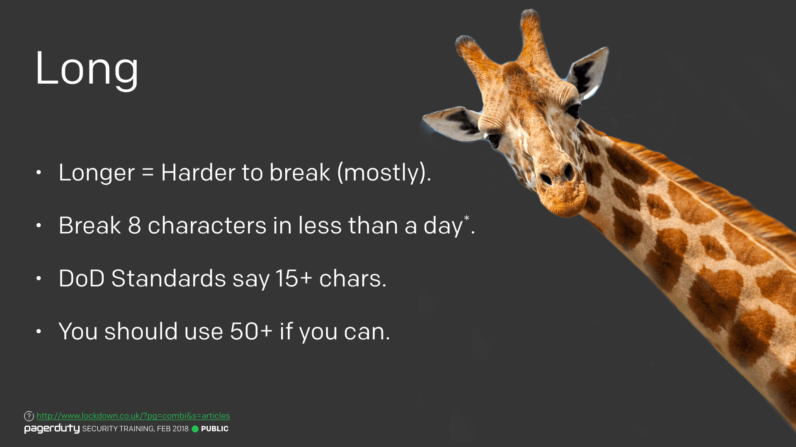</label>
_080. Long. [Reference](http://www.lockdown.co.uk/?pg=combi&s=articles)_

First, your passwords should be long. Hopefully it's mostly intuitive that the longer a password is, the harder it will be to break. At least in general. If your password is 20 of the same character, then that changes things a little.

It's worth noting that it's now possible to break 8 character passwords in less than a day with current computation power, regardless of how it's stored. Now, your average attacker won't have access to this kind of power, we're talking more about nation state actors here.

Current Department of Defense standards recommend 15 or more characters for your password. I recommend 50 or more. I see some wide eyes in the audience, don't worry, I know what you're thinking, and I'll get to it shortly.

---

### Random

<input type="checkbox" id="081" /><label for="081">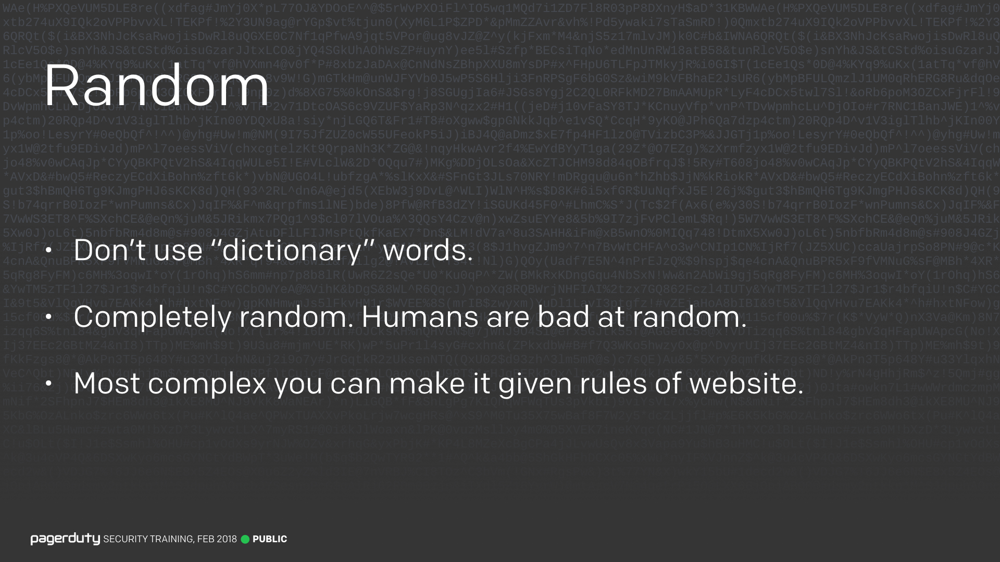</label>
_081. Random._

Next, your passwords also need to be random. I've said here not to use dictionary words, but "dictionary" is in quotes. I don't just mean the English dictionary. There are things called password dictionaries too. Remember a few slides ago, I showed you some email and password combinations that had been broken. When big websites get breached, the broken passwords get added to a password list and sorted by popularity. These can then be used to brute force (i.e. try every possibility until it works) other people's accounts.

So while words like `letmein` aren't in the English dictionary, they will be near the top of any password dictionary. It's just as important not to use these kinds of words.

You need to make them completely random, and humans are very bad at random. Even mashing your keyboard you're probably alternating your right and left hands, meaning there's patterns that can be implied. Computers are the thing that's going to be breaking your passwords, so a computer should be the one generating it too.

Finally, not all websites let you make completely random passwords, unfortunately. Some of them won't let you use certain characters, because of the way their systems work (this is usually an indication they're not storing passwords properly). You need to work within these restrictions, but use as many of the other available characters as you can in your passwords.

---

### Unique

<input type="checkbox" id="082" /><label for="082">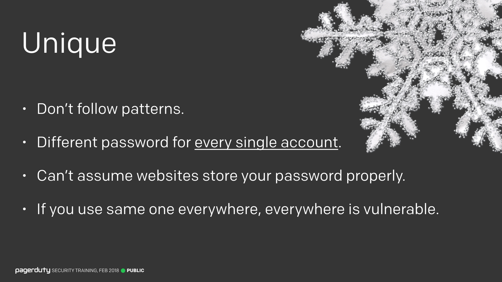</label>
_082. Unique._

Your passwords should be completely unique. Every single account you have should get its own password, and you shouldn't follow patterns. I see advice sometimes where you just pick one password, then append the name of the website to it, that way you get a different password everywhere. This is bad advice, please don't follow it. Firstly, if I break one of your passwords, it's trivial to figure out your pattern, and secondly if you ever need to rotate your password on one site, you're going to have a bad time.

You can't assume anything about how a website stores your password. For all you know they could be storing the password directly (we call this "in the clear", or "in plaintext"). So you need to use a completely unique password for every single login. Anywhere you use the same password becomes vulnerable as soon as one of those sites gets breached. And remember, you may not know about a breach until years later.

---

### Private

<input type="checkbox" id="083" /><label for="083">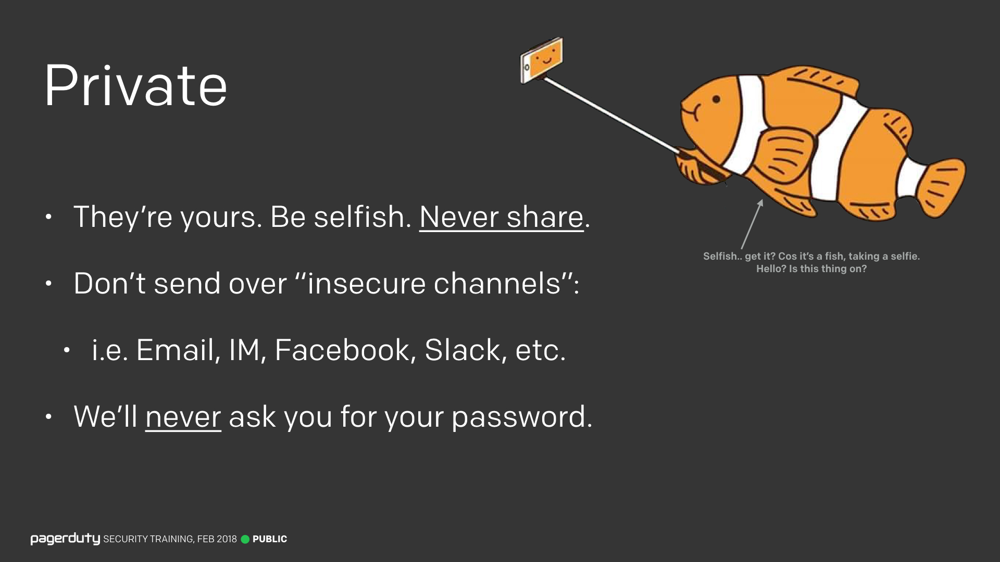</label>
_083. Private._

Finally, your passwords are private. Never ever share them with anyone. Not your loved ones, not your barber, not your Lyft driver. If you do things properly, even you probably won't know your own passwords (I'll get to how in a moment).

Also, you should never send your passwords over insecure channels. Don't email passwords to people, don't send them over IM, or Slack. If we need to share an initial password for you to login to a tool for the first time, we share it using a dedicated tool specifically designed for password management. If you ever accidentally post your password to somewhere that's not secure, you should consider it compromised and change it as soon as possible.

And finally, we will _never_ ask you for your password, under any circumstances. It should be a giant red flag if anyone at LiveIntent ever asks for your password. Never give it out.

---

### Treat passwords like toothbrush.

<input type="checkbox" id="084" /><label for="084">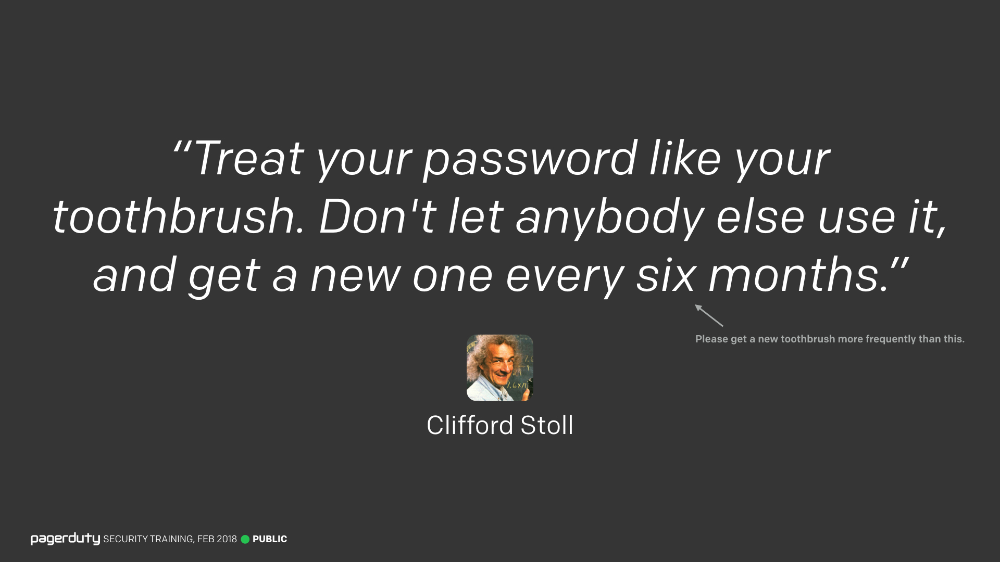</label>
_084. "Treat your password like your toothbrush. Don't let anybody else use it, and get a new one every six months."_

Here's a quote from Clifford Stoll on passwords which I thought was funny. Although I advise you replace your toothbrush a bit more often than six months.

Ok, so now we know what passwords should look like, let's look at a few examples of bad and good passwords.

---

### Bad Passwords

<input type="checkbox" id="085" /><label for="085">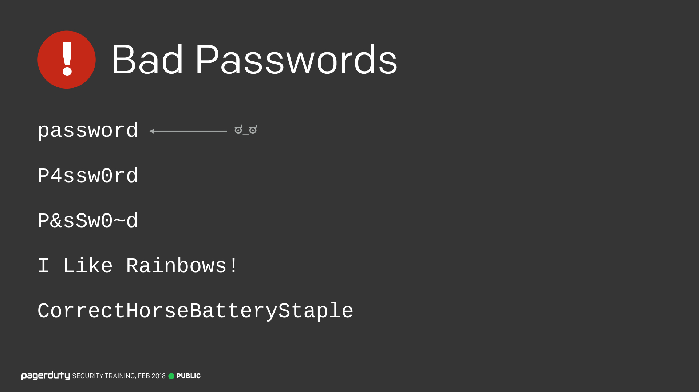</label>
_085. Bad passwords._

Hopefully it's all clear to you why `password` is a really bad password to use. Please don't ever use it, or any dictionary word. What about the next one though, `P4ssw0rd`? The "a" has been replaced with a "4" and the "o" a "0". This can also be trivially broken, as these are standard letter replacements and are a widely known technique. This might add a few minutes to the amount of time it takes to break.

The next one is better, `P&sSw0~d`, we've got special characters in there now, and not some standard replacements. But the password is only 8 characters long, and as we learned earlier, that's too short.

What about `I Like Rainbows!`. This is going to be much harder to break, but there are password cracking tools specifically designed for sentence based passwords. You can treat each word here like an individual "token", and it becomes similar to a 4 character password (albeit with a _much_ larger alphabet). This will certainly take longer than the others to break, but it can be broken much quicker than you probably realise.

And finally, `CorrectHorseBatteryStaple`. This was featured in an [XKCD webcomic](https://xkcd.com/936/) a while back as a method for choosing good passwords. Unfortunately, it's not a great password. Mainly because it's already been featured in the comic and is public information. But this is another known technique, and there are tools that can break passwords which are composed of normal words like this. It will take much longer to break, don't get me wrong, but there are much better passwords you can use.

OK, so what are some good passwords then?

---

### Good Passwords

<input type="checkbox" id="086" /><label for="086">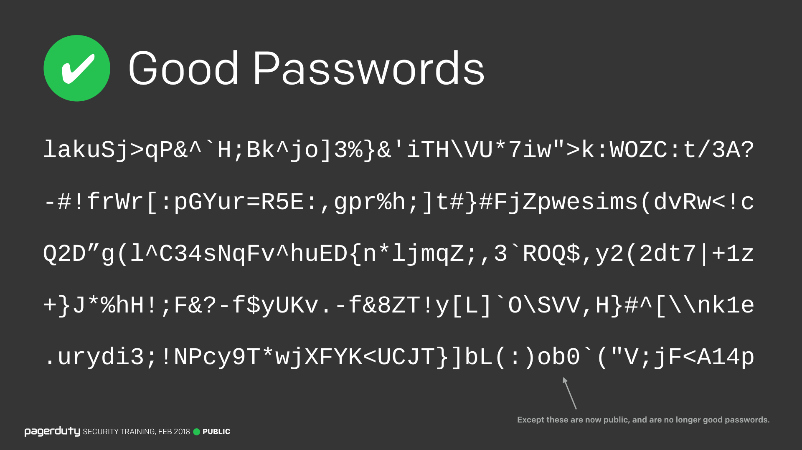</label>
_086. Good passwords._

These are good passwords. They're long, unique, and random. Although obviously they're no longer private because they're on this slide and you've all seen them, but this gives you an idea of what your passwords should be looking like.

Anyone want to take a shot at memorizing these?

Yeah, that's going to be tricky.

---

### Elephant in the Room

<input type="checkbox" id="087" /><label for="087">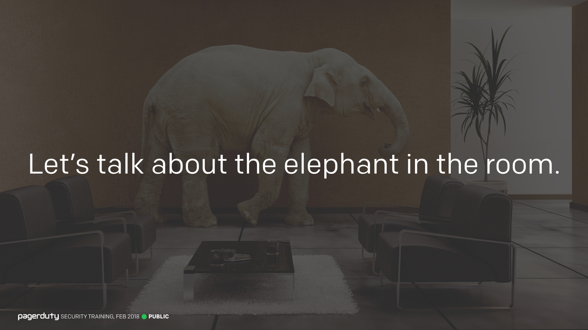</label>
_087. Let's talk about the elephant in the room._

Which brings me to the elephant in the room. The thing a lot of you have been thinking for the last few minutes.

---

### I can't remember that

<input type="checkbox" id="088" /><label for="088">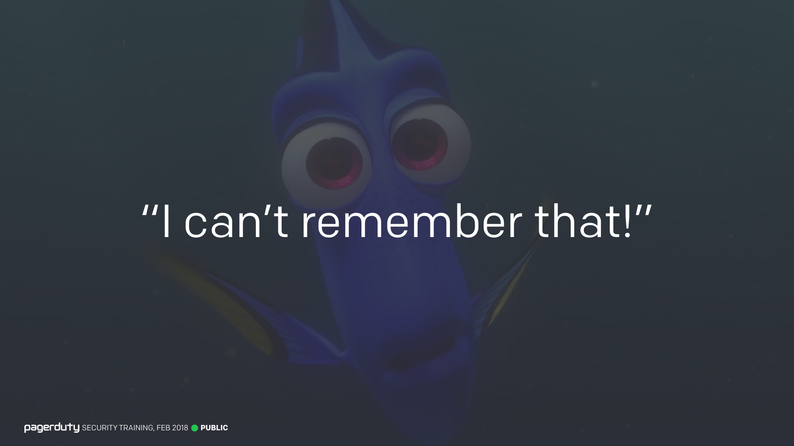</label>
_088. "I can't remember that."_

There's not a chance in hell we can remember those types of passwords.

That's the point. Any password that's easy for a human to remember is going to be even easier for a computer to break. Like I said before, computers are going to be breaking your passwords, so they have to be suitably complex in order to stand up.

So how do you remember all the passwords? You don't.

---

### Use a Password Manager

<input type="checkbox" id="089" /><label for="089">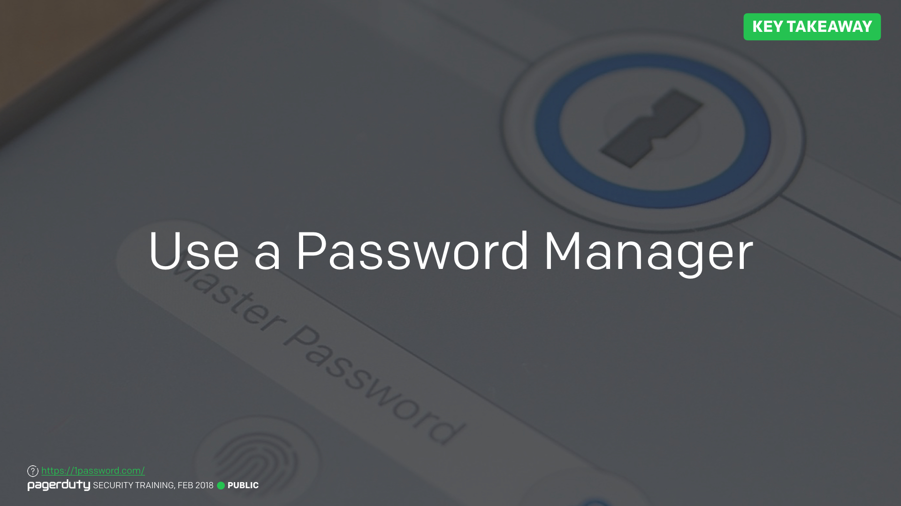</label>
_089. Use a password manager. [Reference](https://1password.com/)_

You need to use a tool called a "Password Manager". There are lots out there, and you've probably heard of a lot of them. "[LastPass](https://www.lastpass.com/)", "[1Password](https://1password.com/)", "[KeePass](https://keepass.info/)", etc. They each have their own pros and cons depending on how you prefer to operate. Most have browser plugins to automatically enter your passwords for you (although there have been some security issues there in the past). But they're all designed to do pretty much one thing. Store a lookup of all your usernames and passwords, protected by a single "master password", which is the one password (hey, that's the name of one of the tools) you need to remember. The idea is that it'll be the last password (hey, that's the name of another one!) you need to remember.

If there's only one thing you take away from today's training, please make it this: Using a password manager is the single most effective thing you can do to enhance your security online. Actually, maybe two-factor authentication too, we'll get to that later though.

Let's talk a bit more about password managers.

---

### Password Managers

<input type="checkbox" id="090" /><label for="090">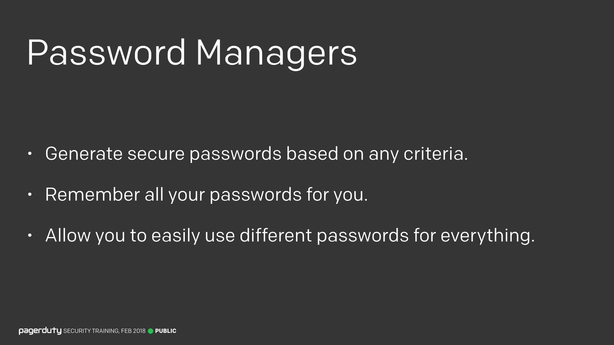</label>
_090. Password managers._

Password managers are designed to remember all of your passwords for you, in a secure way. They can also generate completely random passwords for you, and you can typically change the criteria associated with this generation. So if a website doesn't let you use special symbols, you can exclude those and still get a strong password.

Rich's "Fun" Tidbit: One of the (many) password restrictions on The US Citizenship and Immigration Service website is "Your Password cannot contain the dollar ($) sign". I always thought that seemed a little ironic.

But the most important feature of password managers is that they let you use a completely different password for everything, without having to worry about remembering it yourself.

---

### Password Managers (2)

<input type="checkbox" id="091" /><label for="091">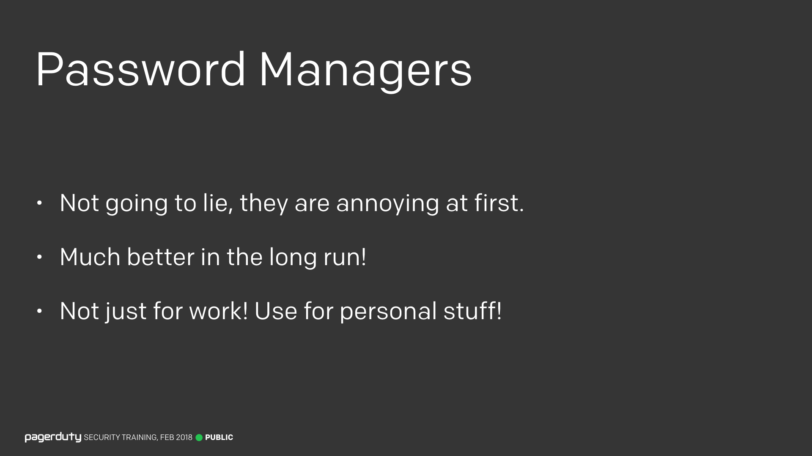</label>
_091. Password managers._

Now, I'm not going to lie to you. Switching from using the same password everywhere, to using a password manager, is reaaally annoying. It's going to slow you down when you want to access websites, and you're going to have to go to every place you have an account and change your password. It really is going to be a pain.

But it gets much easier as you get used to it, and it is so much better in the long run.

I should be clear too, I'm not just advocating for you to use them for all LiveIntent related passwords, you should use one for all your personal accounts too. Amazon, your bank, etc.

---

### Eggs In One Basket

<input type="checkbox" id="092" /><label for="092">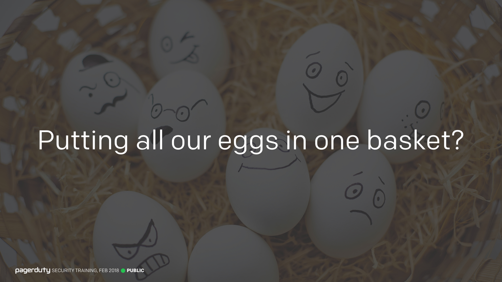</label>
_092. Eggs in a basket._

Some of you may be thinking "aren't we just putting all our eggs in one basket though? What happens if the password manager gets broken into!?!"

---

### Troy Hunt Quote

<input type="checkbox" id="093" /><label for="093">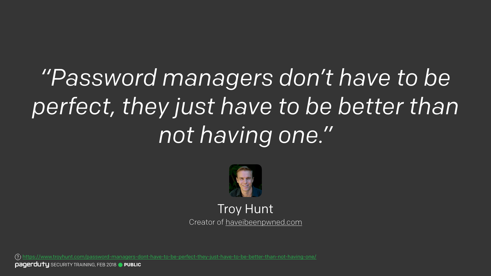</label>
_093. Password managers don't have to be perfect. [Reference](https://www.troyhunt.com/password-managers-dont-have-to-be-perfect-they-just-have-to-be-better-than-not-having-one/)_

And you're right, that is a concern. But we're playing the odds. It is much more likely that you will get compromised if you use the same password everywhere, than it is that an attacker can physically take your password manager _AND_ break your master password. This is why it's important to choose a strong master password.

This quote from Troy Hunt explains it well. Password managers don't have to be perfect, they just have to be better than not having one.

---

### Pick a Good Master Password

<input type="checkbox" id="094" /><label for="094">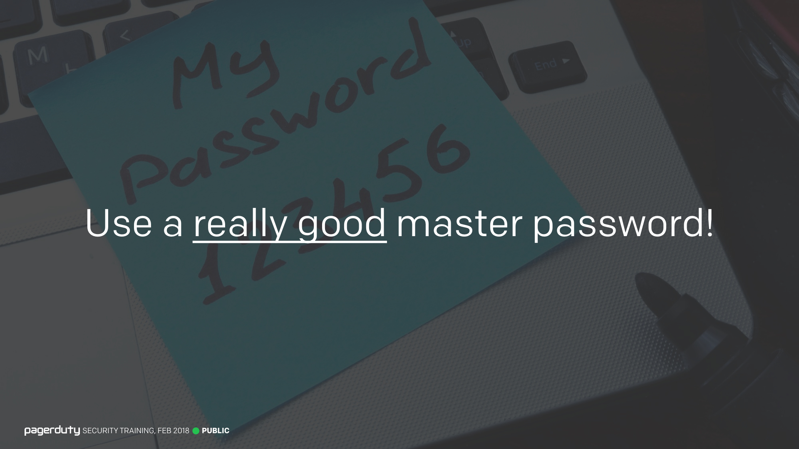</label>
_094. Pick a good master password._

But your password manager is only as good as the master password you pick. So you need to pick a good one, and you need to memorize it. Unfortunately this is one password you can't store in your password manager.

---

### Memory Tips

<input type="checkbox" id="095" /><label for="095">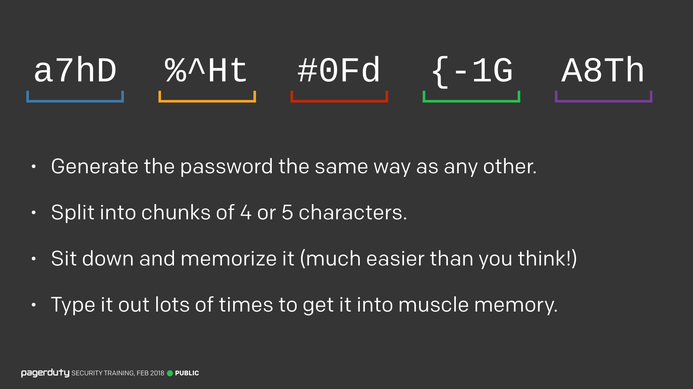</label>
_095. Memory tips._

I have some tips for memorizing a complex password that you may find useful.

First of all though, make sure you generate a password based on the guidelines we've already talked about. It's no good having awesome passwords stored in your password manager if the master password is `letmein`.

To have an easier time of memorizing it, try splitting it into chunks of 4 or 5 characters, like you see here. Then remember those chunks. Literally, just sit down and memorize them. You'll be amazed at how quickly you can retain the information. After about 5 minutes, stop and come back to it later, and see how much you can still remember. It'll take a few tries, but it will soon start to stick.

Another tip is to type out the password lots of times in a text editor, in order to get it into your muscle memory. You'll mess it up a few times at first, but quicker than you think, you'll be typing out a 30 character complex password entirely from memory.

---

Lesson Scenario:
What are the characteristics of strong passwords?

- <input type="checkbox"> `Long`
- <input type="checkbox"> `Foreign language`
- <input type="checkbox"> `Unique`
- <input type="checkbox"> `Private`
- <input type="checkbox"> `Random`

	<button class="button">Reveal Answer</button>
	<blockquote>
Protect yourself with passwords that are long, unique, random, and private.

</blockquote> 
