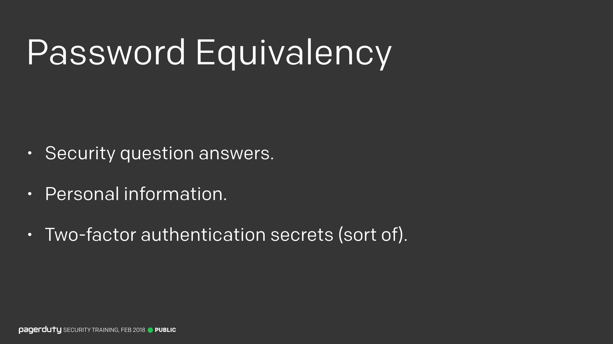
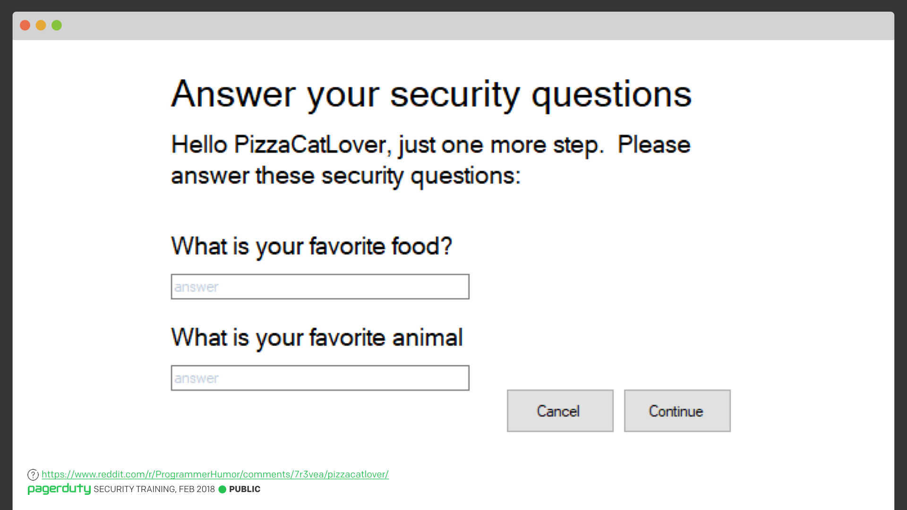
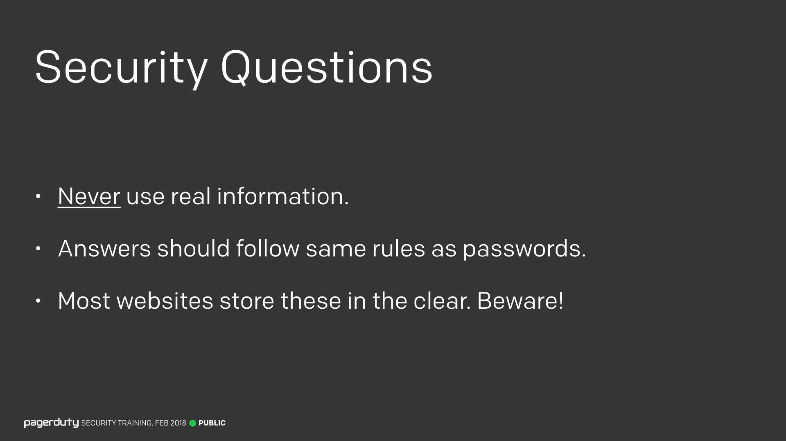
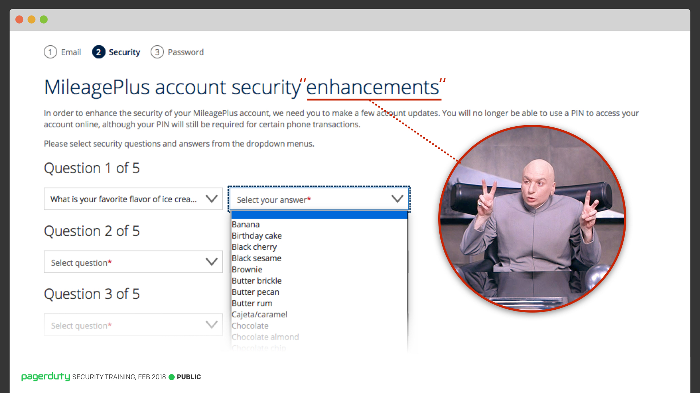
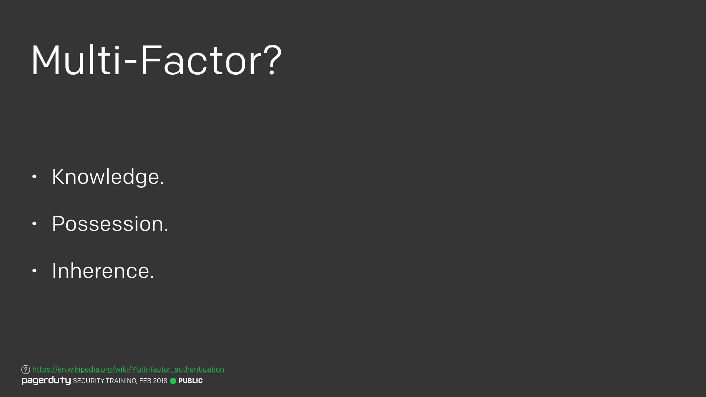
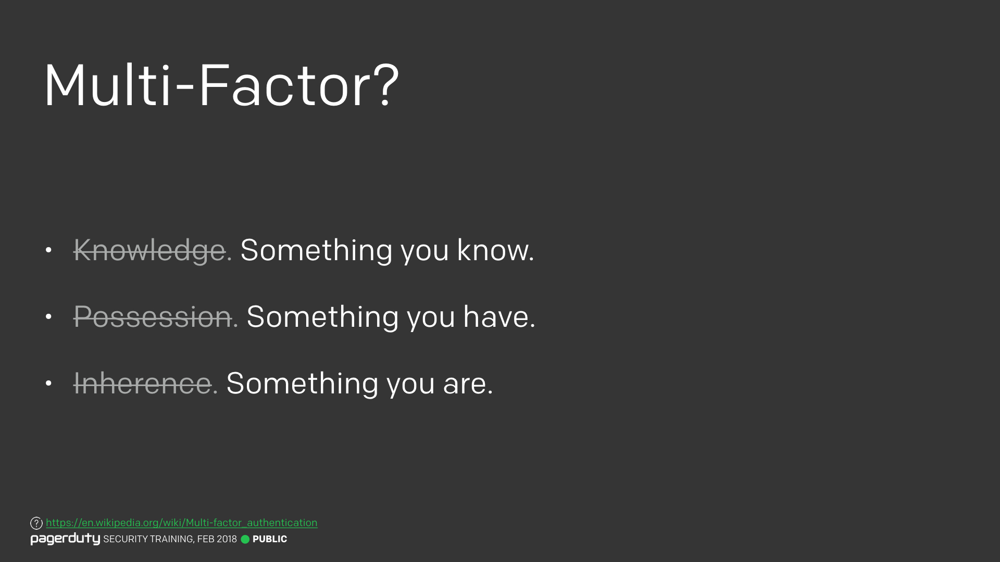
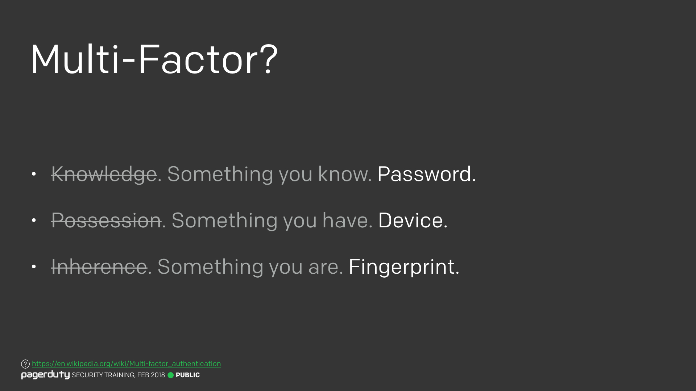
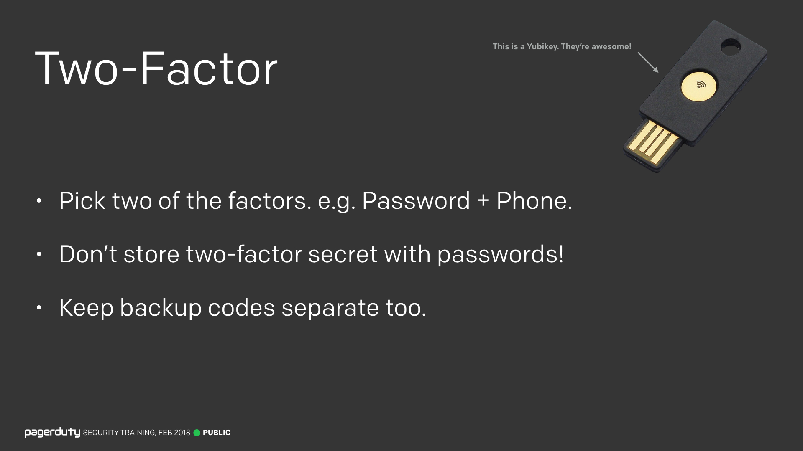
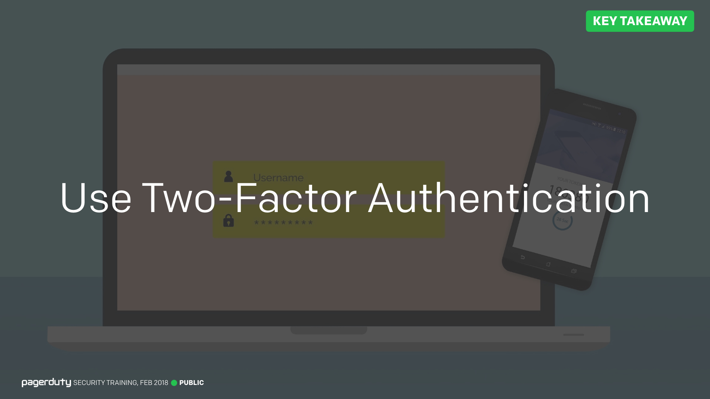

Title:
Lesson 7 | More than Passwords

---

Lesson Notes:
:dart: In addition to passwords, many sites use password equivalents like security questions. Never complete these questions with real information.
:dart: Use two-factor authentication on all of your accounts.

---

Lesson Content:

There's some things that are basically the same as your password. For example, security question answers. If I have that information, I can likely gain access to your account as if I had your password. You should never, ever, under any circumstances use real information.

The idea of two-factor authentication is that you pick two of these factors, and require them in order to authenticate a user. While an attacker might be able to remotely steal your password, it's pretty unlikely they'd also be able to physically steal your phone or get a fingerprint. Likewise, if an attacker can physically steal your phone, it's unlikely they'd also be able to get your password.

The big takeaway from all this, is to make sure you use two-factor authentication wherever it's available. 

---

External resources:

### But Wait, There's More!

<input type="checkbox" id="096" /><label for="096"></label>
_096. But Wait, There's More!._

But wait, there's more! Just because we now have a good process for passwords, doesn't mean that we're done.

---

### Password Equivalency

<input type="checkbox" id="097" /><label for="097"></label>
_097. Password equivalency._

There's some things that are basically the same as your password. For example, security question answers. If I have that information, I can likely gain access to your account as if I had your password.

Personal information too, since a lot of websites will allow you to reset your account based on that information. Does that shopping website really need to know your date of birth? Probably not. Use a fake one and put it into your password manager.

Two-factor secrets are different, they're not equivalent to a password, but I've listed them here since they should be treated as such.

---

### Security Questions

<input type="checkbox" id="098" /><label for="098"></label>
_098. Security Questions. [Reference](https://www.reddit.com/r/ProgrammerHumor/comments/7r3vea/pizzacatlover/)_

I'll be honest, I absolutely hate security questions. They solve a customer support problem, not a security problem. In fact, from a security perspective all they do is weaken it. If you ever have the option not to set security questions at all, take it.

---

### Security Questions

<input type="checkbox" id="099" /><label for="099"></label>
_099. Security Questions._

Unfortunately most websites force you to set security questions and answers, giving you no choice but to enter something.

In which case, you should never, ever, under any circumstances use real information. There's always someone out there who's going to know that information. No matter how strong you make your password, if you use real information for your security questions, your account is going to be easier to compromise. Treat them like passwords, generate them in your password manager and store them there.

Most websites store this information in the clear, despite them being password equivalent, they are not treated as such. Most customer support agents will be able to see them on the screen in front of them.

There's even a slight risk that using randomly generating strings will get you into trouble, as I've been able to convince a support agent in the past that their system must have corrupted the field, which they concurred with since all they saw was random characters. You can't win, so again, we just need to play the odds. It's much more likely that using weak security question answers will get your data stolen.

---

### United Airlines "Security"

<input type="checkbox" id="100" /><label for="100"></label>
_100. United Airlines "Security"._

Some companies go even further with their security questions. Here's United Airlines recent "improvements" to their security. Not only do they force you to pick 5 security questions, but your answers must be chosen from a dropdown of choices they provide.

Now when you need to reset your password, you are given two of these questions, and the answer drop down for each has 10 possible choices. So that's only 100 possible combinations to guess. The irony here is that they implemented this to replace PIN codes, which were 1,000 possible attempts, for not being secure enough.

But again, they give you no choice here. You can't generate your own answers, and you can't opt-out. Sometimes you just have to play their game and move on.

One thing that stood out about these changes are that United called these security questions "Two-Factor Authentication". But that's not entirely accurate.

---

### Multi-Factor Authentication

<input type="checkbox" id="101" /><label for="101"></label>
_101. Knowledge, possession, inherence. [Reference](https://en.wikipedia.org/wiki/Multi-factor_authentication)_

You have heard the term "multi-factor authentication", or "two-factor authentication" a lot. But what exactly is it?

In the field of authentication, there are three main types of evidence (or "factors") you can provide. These are called "Knowledge", "Possession", and "Inherence".

---

### Multi-Factor In Plain English

<input type="checkbox" id="102" /><label for="102"></label>
_102. Multi-Factor. [Reference](https://en.wikipedia.org/wiki/Multi-factor_authentication)_

In plain English, that's Something you know, Something you have, and Something you are.

---

### Password, Device, Fingerprint

<input type="checkbox" id="103" /><label for="103"></label>
_103. Password, Device, Fingerprint. [Reference](https://en.wikipedia.org/wiki/Multi-factor_authentication)_

So, something you know would be a password. Something you have would be your phone, or a physical object. And something you are would be a fingerprint, or some other form of biometrics.

---

### Two-Factor

<input type="checkbox" id="104" /><label for="104"></label>
_104. Two-Factor._

The idea of two-factor authentication is that you pick two of these factors, and require them in order to authenticate a user. While an attacker might be able to remotely steal your password, it's pretty unlikely they'd also be able to physically steal your phone or get a fingerprint. Likewise, if an attacker can physically steal your phone, it's unlikely they'd also be able to get your password.

As you can probably now understand, the United Airlines authentication I showed earlier is not two-factor authentication, as security question answers are the same as you password, they're both "Something you know".

In order for two-factor authentication to be most effective, it's important not to store the two-factor codes with your passwords. This goes back to that security vs convenience trade-off I talked about at the start. It's very convenient to have them in the same place, but then if an attacker gets one, it means they get the other too.

Some password managers let you store the two-factor secrets with the passwords. You do still gain some security advantages there. But it's much better to keep your two-factor codes in a separate password manager. Then if your original master password is broken, an attacker only gets one.

This all applies to backup codes too. Typically you should just print those off and put them somewhere safe. They're your absolute failsafe.

---

### Use Two-Factor Authentication

<input type="checkbox" id="106" /><label for="106"></label>
_106. Use two-factor authentication._

The big takeaway from all this, is to make sure you use two-factor authentication wherever it's available. But you should use it for all your personal stuff too. GMail, Facebook, Dropbox, GitHub, Amazon, etc. They all have two-factor authentication options available.

---

Lesson Scenario:
What is a password equivalent?

- <input type="checkbox"> `A second factor of authentication`
- <input type="checkbox"> `A hardware key`
- <input type="checkbox"> `Information that can be used to gain access to your account even without a password`
- <input type="checkbox"> `MD5 hashing string`

	<button class="button">Reveal Answer</button>
	<blockquote>
Passwords equivalent is information, such as a security question, that can be used to access your account even if you don't have a password.

</blockquote> 
