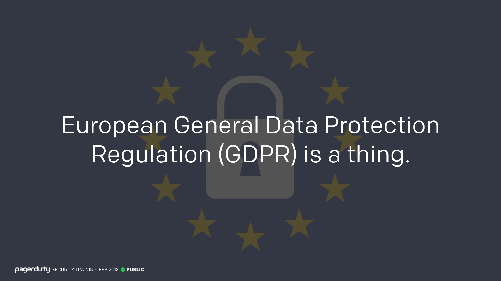
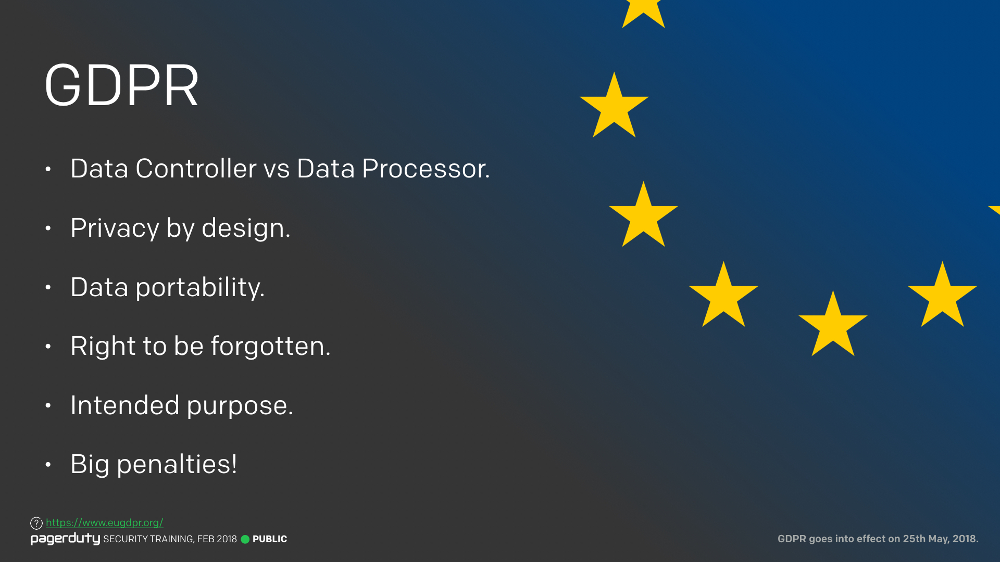

Title:
Lesson 10 | Compliance

---

Lesson Notes:
:dart: GDPR went into effect on 25th May 2018, and has very strict rules for how personal information of EU citizens should be handled.
:dart: GDPR has big fines for those who don't follow the rules.

---

Lesson Content:

Companies have a variety of compliance restrictions which could include GDPR, HIPAA, SOC, PCI, and many more.

GDPR stands for General Data Protection Regulation and is a new European law that went into effect on 25th May 2018. GDPR has strict rules for how personal information of EU citizens should be handled. We are mostly considered a "Data Processor" under GDPR, rather than a Data Controller. Our customers are the data controller (they control the data of their employees), and we process their data on their behalf.

One very important part is that we have to specify the intended purpose of all personal data we will process, and cannot use that data for any other purpose. 

And there are very hefty penalties for any breach of GDPR. 4% of annual global turnover, or €20 Million, whichever is greater.

---

External resources:

### Compliance

_<input type="checkbox" id="129" /><label for="129"></label>_
_129. Compliance._

OK, we're on to our final topic. Compliance.

We have a variety of compliance restrictions that affect how we operate, so I want to spend a bit of time talking about each of them.

---

### GDPR

<input type="checkbox" id="130" /><label for="130"></label>
_130. GDPR._

The first one is GDPR. This stands for General Data Protection Regulation and is a new European law coming into effect later this year. I'm required to tell you that this exists, and is a thing.

...

Just kidding, of course I'm going to go into more detail.

---

### GDPR

<input type="checkbox" id="131" /><label for="131"></label>
_131. GDPR. [Reference](https://www.eugdpr.org/)_

GDPR goes into effect on 25th May 2018, and has very strict rules for how personal information should be handled, with big fines for those who don't follow the rules. We will be subject to GDPR, as we handle data for users who are EU citizens.

We are mostly considered a "Data Processor" under GDPR, rather than a Data Controller. Our customers are the data controller (they control the data of their employees), and we process their data on their behalf. Any customers who are subject to GDPR as controllers will need to execute a Data Processing Agreement (DPA) with us if we are to continue processing their data. Since we also have third-parties which process customer data on _our_ behalf (for example, our notification and telephony providers), we will also need to execute DPA's with them. It's worth noting that there are also a few cases where we would be considered a Data Controller, such as for our UK based employees.

We'll need to include extra steps in our development processes to include data protection from the onset of designing our systems, rather than something that's added on later.

Data portability is the right for a data subject (i.e. our users) to receive the personal data we have stored which concerns them. We need to provide this in a "commonly used and machine readable format". The user also has the right to transmit that data to another controller. Our current API satisfies this constraint, since it allows users to retrieve all the information we have on them, and they can export it and send it to another provider as they see fit.

Another thing GDPR requires is the "Right to be Forgotten", also known as Data Erasure, this entitles the data subject to have the data controller erase his/her personal data, cease further dissemination of the data, and potentially have third parties halt processing of the data.

One very important part is that we have to specify the intended purpose of all personal data we will process, and cannot use that data for any other purpose. For example, if we specify the intended purpose of collecting email addresses is to send company notifications, we cannot then use that email address to send the user marketing material.

And there are very hefty penalties for any breach of GDPR. 4% of annual global turnover, or €20 Million, whichever is greater.

There are more things involved with GDPR that I’ve gone over here, such as “Consent” and “Profiling”, etc. The link at the bottom has more information if you’re interested.

---

### Dear Santa

<input type="checkbox" id="132" /><label for="132"></label>
_132. Dear Santa... [Reference](https://twitter.com/pwnallthethings/status/945353758137049088)_

The bottom line is that GDPR is going to lead to a lot of interesting situations in the industry.

---

### Image Credits

<input type="checkbox" id="142" /><label for="142"></label>
_142. Image credits._

???+ info "Information"
	Here are the credits for all the images used throughout this training.

---

Lesson Scenario:
GDPR governs what type of data?

- <input type="checkbox"> `PII of all humans`
- <input type="checkbox"> `PII of California residents`
- <input type="checkbox"> `Personal information of employees`
- <input type="checkbox"> `Personal information of EU citizens`

	<button class="button">Reveal Answer</button>
	<blockquote>
GDPR is pricipally concerned with personal information of EU citizens.

</blockquote> 
